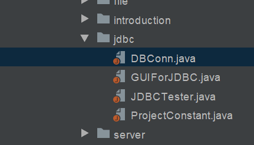
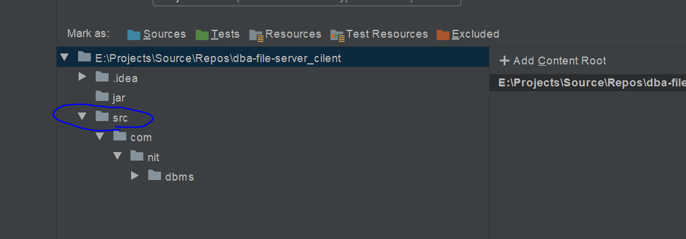
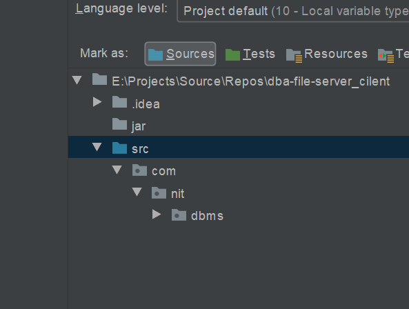

# DBMS(Data Base Management System) 数据库管理系统
基于java
1. DBA 数据库: 各种连接池的Demo位于: com.nit.dbms.action.util
2. 文件
3. GUI
4. fork来源: https://gitee.com/nit-zju_admin/dba/tree/master
5. 请自行使用根目录下的sql文件构建MySQL数据库
6. mybatis + hibernate

* 图标错误, 或无法运行
1. 配置好jdk
2. `现象`
3. `配置源文件目录-1`
4. `配置源文件目录-2`
